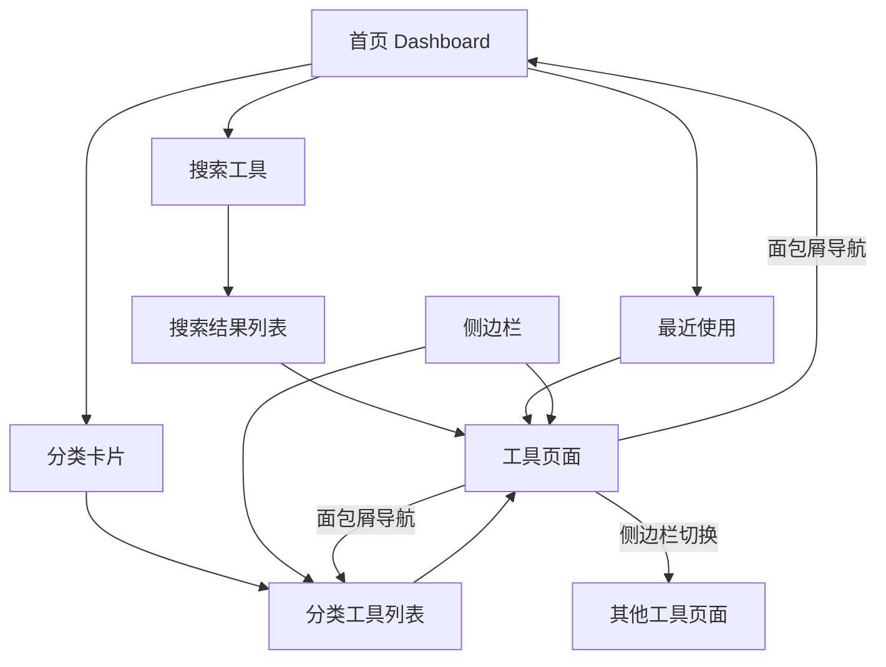
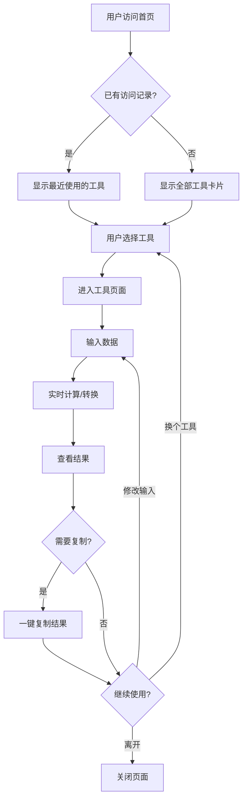
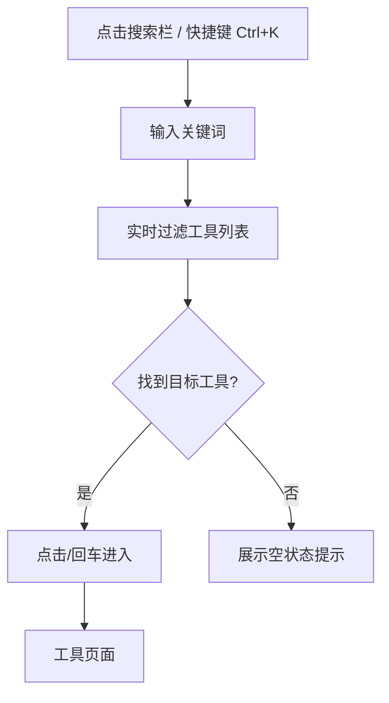
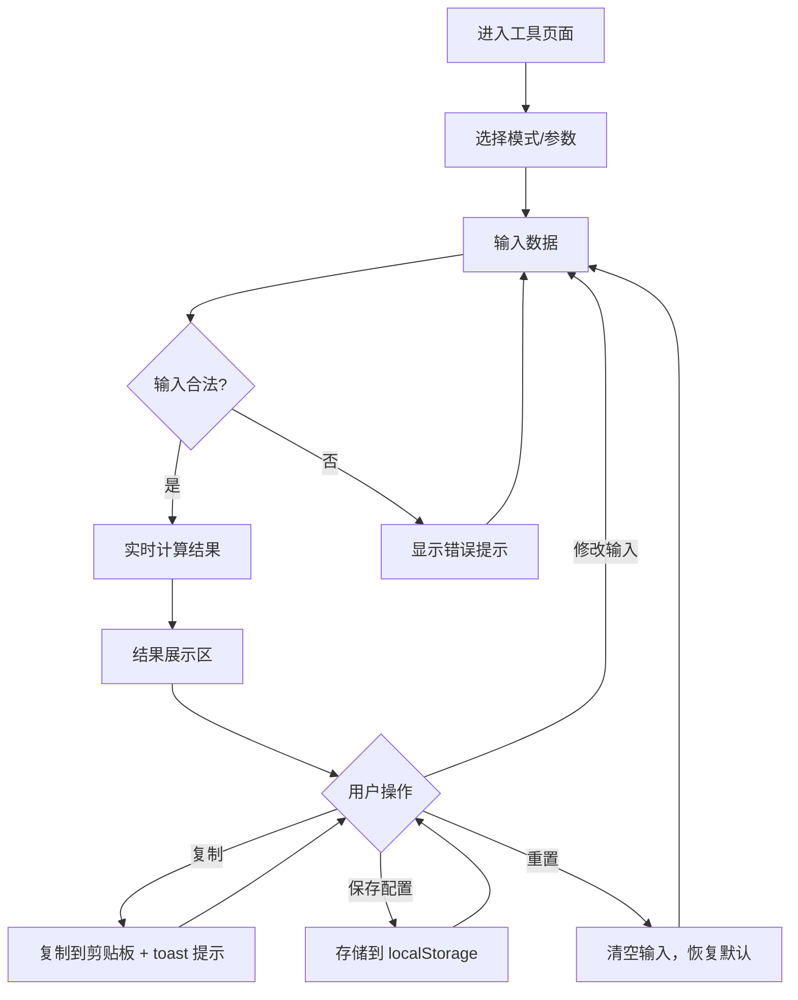
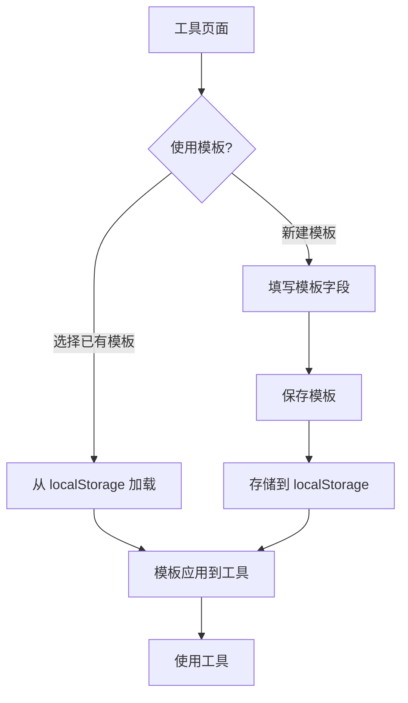
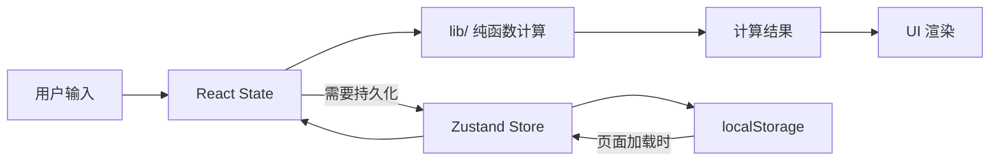

# 应用流程文档

## 1. 路由结构

### 1.1 完整路由表

```
/                                          → 首页 Dashboard
/tools/converter/base-converter            → 进制转换器
/tools/converter/ieee754-parser            → IEEE 754 浮点解析器
/tools/converter/endian-converter          → 字节序转换器
/tools/converter/checksum-calculator       → 校验和计算器
/tools/converter/ascii-table               → ASCII/编码对照表
/tools/protocol/serial-parser              → 串口协议解析器
/tools/protocol/mqtt-parser                → MQTT 报文解析器
/tools/protocol/json-builder               → JSON 协议构造器
/tools/protocol/modbus-generator           → Modbus 帧生成器
/tools/hardware/register-viewer            → 寄存器位域计算器
/tools/hardware/gpio-planner               → GPIO 引脚分配表
/tools/hardware/resistor-calculator        → 电阻色环计算器
/tools/hardware/rc-calculator              → 分压/RC 滤波计算器
/tools/rtos/task-scheduler                 → 任务调度甘特图
/tools/rtos/memory-layout                  → 内存布局可视化
/tools/codegen/bit-operation               → 位操作代码生成器
/tools/codegen/state-machine               → 状态机编辑器
/tools/learning/interview-quiz             → 嵌入式面试题库
```

### 1.2 路由目录结构（App Router）

```
app/
├── layout.tsx                             → 根布局（侧边栏 + 主内容区）
├── page.tsx                               → 首页 Dashboard
└── tools/
    ├── converter/
    │   ├── base-converter/page.tsx
    │   ├── ieee754-parser/page.tsx
    │   ├── endian-converter/page.tsx
    │   ├── checksum-calculator/page.tsx
    │   └── ascii-table/page.tsx
    ├── protocol/
    │   ├── serial-parser/page.tsx
    │   ├── mqtt-parser/page.tsx
    │   ├── json-builder/page.tsx
    │   └── modbus-generator/page.tsx
    ├── hardware/
    │   ├── register-viewer/page.tsx
    │   ├── gpio-planner/page.tsx
    │   ├── resistor-calculator/page.tsx
    │   └── rc-calculator/page.tsx
    ├── rtos/
    │   ├── task-scheduler/page.tsx
    │   └── memory-layout/page.tsx
    ├── codegen/
    │   ├── bit-operation/page.tsx
    │   └── state-machine/page.tsx
    └── learning/
        └── interview-quiz/page.tsx
```

## 2. 页面布局结构

### 2.1 桌面端布局（≥1024px）

```
┌──────────────────────────────────────────────────┐
│  Header（Logo + 搜索栏 + 主题切换）               │
├────────────┬─────────────────────────────────────┤
│            │                                     │
│  侧边栏     │         主内容区                    │
│  (260px)   │                                     │
│            │   ┌─────────────────────────────┐   │
│  数据转换 ▼ │   │                             │   │
│   · 进制转换│   │      工具操作界面             │   │
│   · IEEE754│   │                             │   │
│   · ...    │   │   输入区（上/左）             │   │
│            │   │   结果区（下/右）             │   │
│  协议调试 ▶ │   │                             │   │
│  芯片硬件 ▶ │   └─────────────────────────────┘   │
│  RTOS ▶    │                                     │
│  代码辅助 ▶ │                                     │
│  学习求职 ▶ │                                     │
│            │                                     │
└────────────┴─────────────────────────────────────┘
```

### 2.2 移动端布局（<768px）

```
┌──────────────────────┐
│  Header（Logo + 搜索）│
├──────────────────────┤
│                      │
│     主内容区          │
│                      │
│   工具操作界面        │
│   （全宽，纵向排列）  │
│                      │
│                      │
├──────────────────────┤
│ 转换 │ 协议 │ 硬件 │ …│  ← 底部 Tab
└──────────────────────┘
```

## 3. 页面跳转关系



## 4. 用户操作流程

### 4.1 首次访问流程



### 4.2 工具搜索流程



### 4.3 工具通用操作流程



### 4.4 模板管理流程（适用于串口协议解析器、寄存器位域计算器等）



## 5. 数据流向



## 6. 首页 Dashboard 结构

```
┌─────────────────────────────────────────────┐
│  🔍 搜索工具...                    Ctrl+K   │
├─────────────────────────────────────────────┤
│                                             │
│  最近使用                          查看全部 →│
│  ┌──────┐ ┌──────┐ ┌──────┐ ┌──────┐      │
│  │进制   │ │CRC   │ │寄存器│ │Modbus│      │
│  │转换器 │ │计算器│ │位域  │ │生成器│      │
│  └──────┘ └──────┘ └──────┘ └──────┘      │
│                                             │
│  数据转换工具                               │
│  ┌──────┐ ┌──────┐ ┌──────┐ ┌──────┐      │
│  │      │ │      │ │      │ │      │      │
│  │      │ │      │ │      │ │      │      │
│  └──────┘ └──────┘ └──────┘ └──────┘      │
│                                             │
│  协议调试工具                               │
│  ┌──────┐ ┌──────┐ ┌──────┐ ┌──────┐      │
│  │      │ │      │ │      │ │      │      │
│  │      │ │      │ │      │ │      │      │
│  └──────┘ └──────┘ └──────┘ └──────┘      │
│                                             │
│  ... 其他分类                               │
└─────────────────────────────────────────────┘
```
