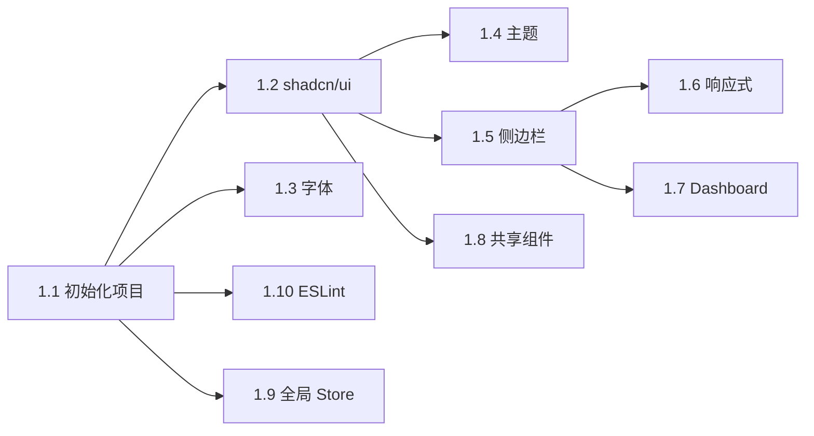
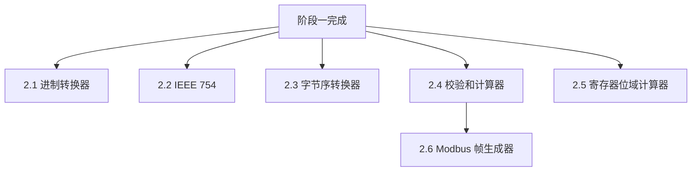
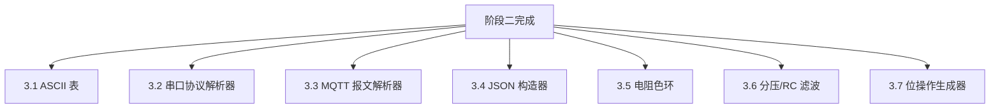
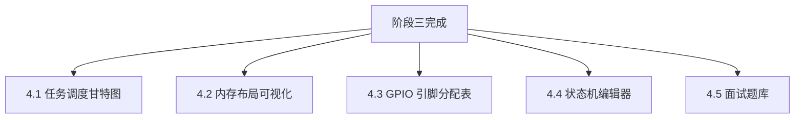

# 分阶段开发计划

## 总览

项目分 4 个阶段开发，每个阶段包含明确的里程碑和交付物。

```
阶段一：基础框架搭建
    ↓
阶段二：数据转换类工具（P0）
    ↓
阶段三：协议/硬件类工具（P0 + P1）
    ↓
阶段四：可视化/高级类工具（P2）+ 部署优化
```

---

## 阶段一：基础框架搭建

### 目标

搭建项目骨架，完成布局系统和共享基础设施，为后续工具开发提供统一的开发环境。

### 任务清单

| # | 任务 | 依赖 | 说明 |
|---|------|------|------|
| 1.1 | 初始化 Next.js 15 项目 | 无 | `pnpm create next-app`，配置 TypeScript + Tailwind CSS 4 + App Router |
| 1.2 | 集成 shadcn/ui | 1.1 | `npx shadcn@latest init`，添加常用基础组件（Button、Card、Input、Select、Dialog、Tooltip、Toast） |
| 1.3 | 配置等宽字体 | 1.1 | 通过 next/font 加载 JetBrains Mono，配置 Tailwind `font-mono` |
| 1.4 | 实现暗色/亮色主题 | 1.2 | 集成 next-themes，默认暗色主题，Header 中添加切换按钮 |
| 1.5 | 实现侧边栏布局 | 1.2 | 左侧 260px 固定侧边栏，分 6 个分类折叠菜单，列出所有 18 个工具入口 |
| 1.6 | 实现响应式导航 | 1.5 | 桌面端侧边栏，平板端可折叠侧边栏，移动端底部 Tab |
| 1.7 | 实现首页 Dashboard | 1.5 | 工具卡片网格 + 搜索栏 + 最近使用模块 |
| 1.8 | 开发共享组件 | 1.2 | HexInput、BitGrid、CopyButton、CodeBlock |
| 1.9 | 配置全局 Zustand Store | 1.1 | app-store（侧边栏状态、最近使用），配置 persist 中间件 |
| 1.10 | 配置 ESLint + Prettier | 1.1 | 代码规范统一 |

### 里程碑

- [x] 项目能 `pnpm dev` 正常启动
- [x] 首页 Dashboard 展示 18 个工具卡片
- [x] 侧边栏导航可折叠，点击可跳转到工具页（显示占位内容）
- [x] 暗色/亮色主题切换正常
- [x] 移动端底部 Tab 导航正常
- [x] 共享组件 HexInput、BitGrid、CopyButton 可用

### 开发顺序



---

## 阶段二：数据转换类工具（P0 核心）

### 目标

完成 6 个 P0 工具，构成 MVP 版本。这些是嵌入式开发者最高频使用的基础工具。

### 任务清单

| # | 工具 | 依赖 | 路由 |
|---|------|------|------|
| 2.1 | 进制转换器 | 阶段一 | `/tools/converter/base-converter` |
| 2.2 | IEEE 754 浮点解析器 | 阶段一 + BitGrid | `/tools/converter/ieee754-parser` |
| 2.3 | 字节序转换器 | 阶段一 + HexInput | `/tools/converter/endian-converter` |
| 2.4 | 校验和计算器 | 阶段一 + HexInput | `/tools/converter/checksum-calculator` |
| 2.5 | 寄存器位域计算器 | 阶段一 + BitGrid | `/tools/hardware/register-viewer` |
| 2.6 | Modbus 帧生成器 | 2.4（复用 CRC 计算逻辑） | `/tools/protocol/modbus-generator` |

### 开发顺序与依赖



**推荐并行策略：**
- Agent A：2.1 进制转换器 + 2.3 字节序转换器（同属数据转换，逻辑相似）
- Agent B：2.2 IEEE 754 + 2.5 寄存器位域计算器（都依赖 BitGrid）
- Agent C：2.4 校验和计算器 → 2.6 Modbus 帧生成器（有依赖关系，串行）

### 里程碑

- [x] 6 个 P0 工具全部可用
- [x] 每个工具通过验收标准（见 PRD）
- [x] 暗色/亮色主题下所有工具显示正常
- [x] 移动端布局适配完成

---

## 阶段三：协议/硬件类工具（P1）

### 目标

完成 7 个 P1 工具，覆盖协议调试和硬件辅助场景，形成完整的工具矩阵。

### 任务清单

| # | 工具 | 依赖 | 路由 |
|---|------|------|------|
| 3.1 | ASCII/编码对照表 | 阶段一 | `/tools/converter/ascii-table` |
| 3.2 | 串口协议解析器 | 阶段一 + HexInput + FieldHighlighter | `/tools/protocol/serial-parser` |
| 3.3 | MQTT 报文解析器 | 阶段一 + FieldHighlighter | `/tools/protocol/mqtt-parser` |
| 3.4 | JSON 协议构造器 | 阶段一 | `/tools/protocol/json-builder` |
| 3.5 | 电阻色环计算器 | 阶段一 | `/tools/hardware/resistor-calculator` |
| 3.6 | 分压/RC 滤波计算器 | 阶段一 + Recharts | `/tools/hardware/rc-calculator` |
| 3.7 | 位操作代码生成器 | 阶段一 + BitGrid + CodeBlock | `/tools/codegen/bit-operation` |

### 新增共享组件

| 组件 | 说明 | 使用工具 |
|------|------|----------|
| `FieldHighlighter` | 协议帧字段颜色高亮 | 串口解析器、MQTT 解析器 |

### 开发顺序与依赖



**推荐并行策略：**
- Agent A：3.1 ASCII 表 + 3.5 电阻色环（独立工具，无依赖）
- Agent B：3.2 串口协议解析器 + 3.3 MQTT 解析器（共享 FieldHighlighter）
- Agent C：3.4 JSON 构造器 + 3.7 位操作代码生成器
- Agent D：3.6 分压/RC 滤波计算器（需要 Recharts 集成）

### 里程碑

- [x] 7 个 P1 工具全部可用
- [x] FieldHighlighter 共享组件在串口和 MQTT 解析器中正确工作
- [x] 波特图 Recharts 渲染正常
- [x] 所有模板保存/加载功能正常

---

## 阶段四：可视化/高级类工具（P2）+ 部署优化

### 目标

完成 5 个 P2 工具（交互复杂度最高），进行性能优化，完善部署方案。

### 任务清单

| # | 工具 | 依赖 | 路由 |
|---|------|------|------|
| 4.1 | 任务调度甘特图 | 阶段一 + Recharts | `/tools/rtos/task-scheduler` |
| 4.2 | 内存布局可视化 | 阶段一 + Recharts | `/tools/rtos/memory-layout` |
| 4.3 | GPIO 引脚分配表 | 阶段一 | `/tools/hardware/gpio-planner` |
| 4.4 | 状态机编辑器 | 阶段一 | `/tools/codegen/state-machine` |
| 4.5 | 嵌入式面试题库 | 阶段一 | `/tools/learning/interview-quiz` |

### 开发顺序与依赖



**推荐并行策略：**
- Agent A：4.1 任务调度甘特图 + 4.2 内存布局可视化（都用 Recharts）
- Agent B：4.3 GPIO 引脚分配表（需要芯片数据库）
- Agent C：4.4 状态机编辑器（画布拖拽交互复杂）
- Agent D：4.5 面试题库 + 题目数据录入

### 部署优化任务

| # | 任务 | 说明 |
|---|------|------|
| 4.6 | 性能优化 | 代码分割检查、图片优化、Lighthouse 跑分 |
| 4.7 | SEO 优化 | 每个工具页面的 metadata、Open Graph 标签 |
| 4.8 | 静态导出验证 | 验证 `output: 'export'` 模式下所有工具正常工作 |
| 4.9 | 自建服务器部署文档 | 编写 Nginx 配置模板和 PM2 启动脚本 |

### 自建服务器部署准备

面向未来迁移到 2 核 2GB 自建服务器的准备：

**方式一：Node.js 运行**
```bash
# PM2 进程管理
pm2 start pnpm --name embed-toolkit -- start
pm2 save
pm2 startup
```

**方式二：静态导出 + Nginx（推荐）**
```bash
# next.config.ts 中设置 output: 'export'
pnpm build
# 将 out/ 目录部署到 Nginx root
```

验证清单：
- [x] `output: 'export'` 模式下所有 18 个工具页面正常渲染
- [x] 静态资源缓存策略配置正确
- [x] Nginx try_files 规则确保客户端路由正常
- [x] 2 核 2GB 服务器压力测试通过

### 里程碑

- [x] 全部 18 个工具开发完成
- [x] Lighthouse Performance 评分 ≥ 90
- [x] 静态导出模式验证通过
- [x] 自建服务器部署文档完成
- [x] 面试题库至少 100 道题目

---

## 开发阶段总览

| 阶段 | 内容 | 工具数 | 里程碑标志 |
|------|------|--------|------------|
| 一 | 基础框架搭建 | 0 | 项目骨架 + 布局 + 共享组件 |
| 二 | 数据转换类（P0） | 6 | MVP 可用 |
| 三 | 协议/硬件类（P1） | 7 | 完整工具矩阵 |
| 四 | 可视化/高级类（P2）+ 部署 | 5 | 全量发布 |

## Agent-Team 协作分工建议

```
主 Agent（协调者）
├── 阶段一：主 Agent 独立完成框架搭建
├── 阶段二：3 个 Agent 并行开发 6 个 P0 工具
│   ├── Agent A：进制转换器 + 字节序转换器
│   ├── Agent B：IEEE 754 + 寄存器位域
│   └── Agent C：校验和计算器 → Modbus 帧生成器
├── 阶段三：4 个 Agent 并行开发 7 个 P1 工具
│   ├── Agent A：ASCII 表 + 电阻色环
│   ├── Agent B：串口协议解析器 + MQTT 解析器
│   ├── Agent C：JSON 构造器 + 位操作生成器
│   └── Agent D：分压/RC 滤波计算器
└── 阶段四：4 个 Agent 并行开发 5 个 P2 工具
    ├── Agent A：任务调度甘特图 + 内存布局
    ├── Agent B：GPIO 引脚分配表
    ├── Agent C：状态机编辑器
    └── Agent D：面试题库
```

每个 Agent 在独立 git worktree 中工作，完成后提 PR 到 `dev` 分支，由主 Agent 审查合并。

---

## 实际开发记录

本节记录项目实际执行过程中遇到的真实问题和经验教训，供后续类似项目参考。

### 阶段一：顺利

- 按计划独立完成，`pnpm build` 一次通过（仅修了 shadcn/ui 新版本 `TooltipTrigger` 不再支持 `asChild` 的 2 处类型错误）
- Next.js 实际装到了 16（`create-next-app@latest` 的默认），而非原计划的 15；无兼容性问题

### 阶段二：3 PR 全部冲突，手动合并

- 3 个 Agent 并行提交了 PR，但都基于阶段一之前的 dev 分支（未 rebase 最新 dev）
- 每个 PR 都修改了工具占位页面 `page.tsx`（Agent 写真实组件），同时主 Agent 在 dev 上已加了 metadata export，导致 6 个 page.tsx 全部冲突
- 解决：本地 `git merge origin/feat/xxx` 逐个处理，合并时保留两边——PR 的组件引用 + 主 Agent 的 metadata
- 经验：多 Agent 并行前，PR 分支应基于最新 dev；或约定 Agent 只修改 `components/`、`lib/` 等非公共文件，`page.tsx` 由主 Agent 收尾

### 阶段三：Agent 中途用量耗尽，代码残留在 worktree 中

- 4 个 Agent 并行启动不久就都因"用量限制"中断，但都写出了大部分代码（`types/`、`lib/`、`components/` 基本完整），只是没来得及 commit + 创建 PR
- Agent B（串口 + MQTT 解析器）：TemplateEditor 和 MqttParser UI 组件未完成，由主 Agent 补齐
- 解决：主 Agent 从各 worktree 的未提交变更中把代码手工复制到主项目，统一构建、修复 3 处类型错误（shadcn/ui Select 的 `onValueChange` 签名变化、Recharts Tooltip formatter 类型）、一次性 commit
- 经验：agent 中断风险大时，prompt 里应强调"先提交再继续开发"，或拆分更小的任务粒度

### 阶段四：分批生成 + JSON 引号陷阱

- Agent D（面试题库）中途被终止，只写了 2 个分类的 JSON（54 题）+ types，缺 lib/UI/store，主 Agent 全部补齐
- 首次 `pnpm build` 失败：`rtos.json` 的中文解析文字里有**未转义的英文双引号**（如 `没有所谓的"编译态"`），用正则逐行扫描 + 转义修复
- 题库扩充到 446 题分成 16 批次（每批 20 题），每批独立 commit + push + build，避免单次 token 超限
- 经验：JSON 里的中文引号、代码样例引号易漏转义，用 `JSON.parse` 做自动校验

### 阶段四遗留项（待做）

- [ ] 性能优化和 Lighthouse 跑分（任务 4.6）
- [ ] 静态导出模式 `output: 'export'` 验证（任务 4.8）
- [ ] 自建服务器部署实战文档（任务 4.9，目前仅 tech_stack.md 中有方案说明）
- [x] 在线 Demo 部署到 <https://embed-toolkit.vercel.app/>（v1.0.0 已上线）

### 产出总结

- 代码：约 16000+ 行 TS/TSX + 约 4500 行 JSON 题库
- 18 个工具 + 446 道题 + 6 个规划文档
- 30+ commits 贯穿 4 个阶段
- 零构建警告通过

### 协作模式有效性评估

| 环节 | 效果 | 备注 |
|------|------|------|
| 主 Agent 做框架 + 规划 | 高效 | 框架一次到位，后续 Agent 产出质量整齐 |
| Worktree 隔离 + 并行 Agent | 中等 | 代码冲突和 Agent 中断风险是两大痛点 |
| PR 审查 + 合并到 dev | 有效 | 多数工具通过 PR 审查即可合并，偶有格式问题手动修 |
| 分批迭代（如题库 16 批） | 高效 | 规避 token 限制，每批独立验证，质量可控 |

---

## 阶段五：功能扩展（v1.1.0）

### 目标

在 v1.0.0（18 工具）基础上新增 5 个高频需求工具和 8 款芯片数据，覆盖更多实际开发场景。

### 第一批：3 个硬件计算器 + 8 款芯片（4 Agent 并行）

| # | 工具/任务 | Agent | 路由 |
|---|-----------|-------|------|
| 5.1 | 定时器/PWM 计算器 | A | `/tools/hardware/timer-calculator` |
| 5.2 | 波特率误差计算器 | B | `/tools/hardware/baudrate-calculator` |
| 5.3 | ADC 采样计算器 | C | `/tools/hardware/adc-calculator` |
| 5.4 | GPIO 芯片扩充 ×8 | D | `lib/gpio-planner/chips/` |

新增芯片：STM32F103RCT6、STM32F103ZET6、STM32F407VET6、STM32F411CEU6、STM32G431RBT6、ESP32-S3、ESP32-C3、GD32F103C8T6

### 第二批：2 个高级工具（2 Agent 并行）

| # | 工具 | Agent | 路由 |
|---|------|-------|------|
| 5.5 | 时钟树可视化配置器 | A | `/tools/hardware/clock-tree` |
| 5.6 | PID 调参模拟器 | B | `/tools/rtos/pid-simulator` |

### 里程碑

- [x] 3 个硬件计算器开发完成
- [x] 8 款新芯片数据全部就位（总计 10 款）
- [x] 时钟树配置器（STM32F1/F4/H7 三套约束 + C 代码导出）
- [x] PID 模拟器（3 种系统模型 + Recharts 图表 + 性能指标）
- [x] `pnpm build` 27 页面零错误
- [x] 合并到 main，tagged v1.1.0

---

## 阶段六：工程诚实 + 生产力工具扩展（v1.2.0 → v1.3.0）

Claude Code + Codex 双 agent 审查驱动的两次发布。v1.2.0 聚焦"准确性闭环"，v1.3.0 聚焦"工具规模 + 口径工程诚实"。

### v1.2.0（2026-04-17）— 准确性闭环

**背景**：Codex 对 v1.1.0 做安全/正确性审查，给出 P1/P2/P3 三级改进清单。主 agent 串行修复 + 验证 + 发版。

| 类别 | 关键修复 | 决策点 |
|------|----------|--------|
| **芯片扩容** | GPIO 引脚分配器从 10 款扩到 45 款（STM32F1/F4/G0/G4/H7/L4 全系 + ESP32 全系 + GD32/CH32/AT32 国产线） | chip 数据迁移到 `public/chips/*.json` 按需 fetch，减小首屏 bundle。`scripts/generate-chips.ts` 从 STM32_PORTS_{64,100,144} 模板 + F1_AF/F4_AF mapping 批量生成 |
| **波特率编码** | USARTDIV 整数分频器 → 完整 BRR mantissa/fraction 编码 | OVER16: BRR[15:4]+BRR[3:0]（4 bit fraction）；OVER8: 3 bit fraction，BRR[3]=0。UI + 公式说明 + 复制按钮全部改走 BRR 口径 |
| **时钟树 VCO** | `checkViolations` 用 `freqs.pllOutput`（PLLP 分频后）校验 VCO → 漏检低频场景 | 在 `calcPllOutput` 中显式保留 VCO 频率并透传到 `ClockFrequencies.vco`，`checkViolations` 双向校验 `vcoRange`。F4 [192, 432] MHz / H7 [192, 836] MHz |
| **Register viewer 32-bit 掩码** | `(1 << 32) - 1 === 0` JS 位运算陷阱 | `width >= 32 ? 0xFFFFFFFF : ((1 << width) - 1)` |
| **HexInput 0x 前缀** | `/[\s0x]/gi` 吞掉所有 `0` 字符 | 改为 `/^0x/i + /\s+/g` 顺序处理 |
| **Store schema 守卫** | 篡改过的 localStorage 导致运行时崩溃 | `stores/_schema-guards.ts` 共享 `isRecord / isStringArray`，6 个持久化 store 接入 `makeSafeMerge` |
| **闭环 generateCode** | 时钟树违规时仍能导出 C 代码，用户可能把错误配置烧进硬件 | 存在违规时 `generateCode` 直接返回 error，不再产出 SystemClock_Config() |

**里程碑**
- 10 芯片 → 45 芯片，3 个持久化 store 加 schema 守卫
- 测试 35 → 82（+47），新增 clock-tree VCO / baudrate BRR / gpio-planner code generator / adc-calculator
- `pnpm build` 30+ 页面零错误，合并到 main，tagged `v1.2.0` at commit `1696871`

### v1.2.0 → v1.3.0 过渡期 — 线上反馈修复

用户 Vercel 实测反馈 3 个运行时 bug，独立 commit 修掉：

- `8f0e6d7` **interview-quiz 首题无响应** — `displayQuestion` 兜底选题但 `currentQuestion` 仍 null，`handleSubmit` 早 return。改用 displayQuestion 作为权威题目 + 同步 currentQuestion
- `710ce51` **interview-quiz 重置粘连** — `handleReset` 漏清 `selectedOption` / `showAnswer`，上一题的"已提交"视图粘到新轮第一题
- `a08f6f4` **interview-quiz 提交跳题** — `displayQuestion` memo 用 `pool.some()` 校验，pool 又被 answeredIds 过滤 → 提交后当前题"无效"回落 pickRandom 选新题，叠加 `showAnswer=true` 暴露下一题答案。抽出纯函数 `selectDisplayQuestion(currentQuestion, loadedPool, pool)` 用 `loadedPool`（不随 answeredIds 变化）校验
- `1433103` 侧边栏 `ScrollArea` 补 `min-h-0` + GPIO 芯片列表去掉 `slice(0, 30)` 硬截断

### v1.3.0（2026-04-17）— 工具规模 + 工程诚实

**背景**：用户要求把 RTOS 从 3 → 6、代码辅助从 2 → 6，真正把工具站做成"解决开发痛点"的生产力平台。

#### Batch 2：3 个 RTOS 工具（3 Agent 并行 worktree-less）

| # | 工具 | 路由 | 核心算法 |
|---|------|------|----------|
| 6.1 | 任务栈深度估算器 | `/tools/rtos/stack-estimator` | 调用链字节累加 + ISR 32B 压栈 + printf 512B 修正 + 30% 余量，向上取整到 configMINIMAL_STACK_SIZE 整数倍，支持 FreeRTOS / RT-Thread / 通用 3 套预设 |
| 6.2 | IPC 选型决策树 | `/tools/rtos/ipc-selector` | 交互式决策树，9 个推荐叶节点（Mutex with PI / Binary / Counting Semaphore / Queue / Stream Buffer / Task Notification / Event Group / Software Timer / vTaskDelayUntil），每叶带 API 签名 + 代码示例 + 陷阱 + 替代方案 |
| 6.3 | 优先级反转可视化 | `/tools/rtos/priority-inversion` | 3 任务 + 1 mutex 的 1ms tick 调度状态机仿真，对比 PIP on/off 的甘特图（Recharts via next/dynamic）与 high 任务等待时间差 |

3 个 agent 各写各的 types / lib / lib-test / component / page，互不冲突。主 agent 等全部完成后统一更新 `lib/tools-config.ts` + 引入新图标（Layers / GitBranch / ShieldCheck）。commit `c2d9957`。

#### Batch 3：4 个代码辅助工具（4 Agent 并行）

| # | 工具 | 路由 | 核心数据规模 |
|---|------|------|----------|
| 6.4 | 外设驱动模板生成器 | `/tools/codegen/driver-template` | 6 外设（UART/SPI/I2C/ADC/TIM/PWM）× 6 MCU（STM32F1/F4/H7/G0/L4 + ESP32）× 3 风格（HAL/LL/Arduino），generators/ 按外设拆分 6 个子模块 |
| 6.5 | 中断服务程序模板 | `/tools/codegen/isr-template` | 8 种 ISR × 5 STM32 系列，HAL 差异已适配（F1/F4 EXTI 单宏 vs H7/G0 双宏、DMA Stream vs Channel 等），3 种任务通知机制 + 临界区开关 |
| 6.6 | 嵌入式数据结构生成器 | `/tools/codegen/data-structure` | 4 种结构：Ring buffer（power-of-two 校验）/ 状态机宏（双层 switch）/ 软件定时器数组 / 事件 Pub/Sub |
| 6.7 | API 速查卡 | `/tools/codegen/api-cheatsheet` | FreeRTOS 30 条 + STM32 HAL 30 条，含签名 / 参数 / 用法代码 / 常见陷阱，按 library+category 筛选 + 模糊搜索 |

4 个 agent 并行。主 agent 统一更新 `lib/tools-config.ts` + 新图标（Wrench / BellRing / Boxes / BookOpen）+ 版本号 1.2.0 → 1.3.0 + README / CLAUDE.md / CHANGELOG 计数同步。commit `f301a61`，tagged `v1.3.0` at `6bc5708`。

#### Codex v1.3.0 审查 → engineering-honest 口径修正

Codex 指出 4 个工具"承诺过头"，不符合"工程诚实"原则。主 agent 串行 5 commit 回应：

| Commit | 工具 | 修正 |
|--------|------|------|
| `e027d6d` | driver-template | 定位从"一键生成可编译代码"改为"**驱动脚手架**"。生成结果页顶部加黄色 warning banner 列 5 条已知限制：LL I2C 主机收发 TODO、ESP32 引脚映射依赖板型、SPI CS 宏占位、NVIC 优先级保守默认、RCC/GPIO 需 board init 预置 |
| `fe96a68` | data-structure | Ring buffer "线程安全" → **单写单读 ISR 安全**（SPSC）。多写多读明确指向 StreamBuffer 或 Mutex。Software timer 协作式 + tick ISR 上下文限制（禁止阻塞 / 非 FromISR / printf / malloc / 浮点） |
| `1f25ac9` | stack-estimator | ToolIntro 加免责：结果仅作起点参考，必须用 `uxTaskGetStackHighWaterMark` 动态测量验证。结果页底部新增"用动态测量校准"卡片含示例代码与最深分支提示 |
| `493b6fa` | ipc-selector | 决策树重排：`Q1.mutex` 直接推荐 Mutex with PI（不再问"是否担心 PI"），Binary Semaphore 改挂在 `Q3.signal-only → Q3a.multi` 分支（ISR→多任务共享通知），文案/示例/pitfalls/alternatives 全部改写口径 |
| `14f017d` | package.json | shadcn（CLI 工具）从 `dependencies` 移到 `devDependencies` + `pnpm.overrides` 锁 hono ≥ 4.12.14，消除 hono 中危告警 |

随后 `cff3285` 修 stack-estimator 新增文本里的未转义中文引号（react/no-unescaped-entities）。v1.3.0 tag 移到 `cff3285` 作为最终 release commit（方案 A：tag 指向最终功能 commit，post-release 纯文档 fixup 不再移动 tag）。

### v1.3.0 里程碑

- [x] RTOS 工具数 3 → 6，代码辅助工具数 2 → 6，总工具数 23 → 30
- [x] 7 个新工具各自 types / lib / lib-test / component / page 五件套齐全，覆盖 99 个新单元测试
- [x] 测试总数 82 → 181（+99，+121%），`pnpm build` 37 页面零警告
- [x] Codex v1.3.0 审查 engineering-honest 口径修正全部落地（5 commits）
- [x] hono 中危告警修复（devDeps 迁移 + pnpm override）
- [x] 合并到 main，tagged `v1.3.0` at commit `cff3285`
- [x] 部署至 Vercel（<https://embed-toolkit.vercel.app/>）
