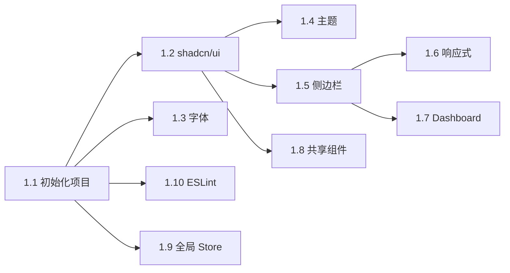
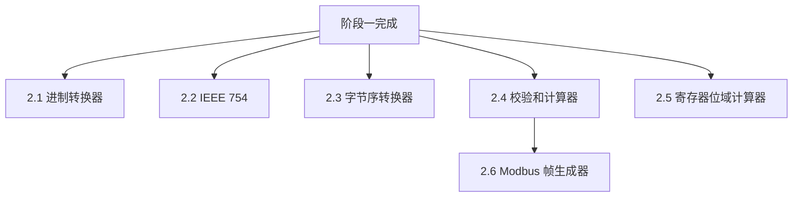
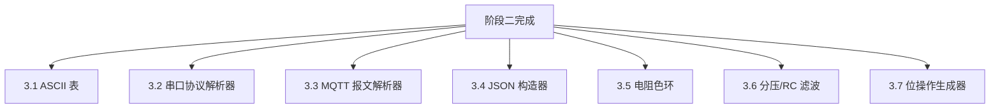
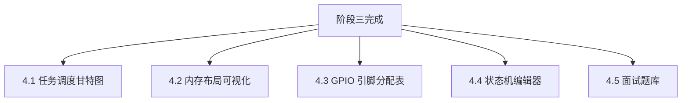

# 分阶段开发计划

## 总览

项目分 4 个阶段开发，每个阶段包含明确的里程碑和交付物。

```
阶段一：基础框架搭建
    ↓
阶段二：数据转换类工具（P0）
    ↓
阶段三：协议/硬件类工具（P0 + P1）
    ↓
阶段四：可视化/高级类工具（P2）+ 部署优化
```

---

## 阶段一：基础框架搭建

### 目标

搭建项目骨架，完成布局系统和共享基础设施，为后续工具开发提供统一的开发环境。

### 任务清单

| # | 任务 | 依赖 | 说明 |
|---|------|------|------|
| 1.1 | 初始化 Next.js 15 项目 | 无 | `pnpm create next-app`，配置 TypeScript + Tailwind CSS 4 + App Router |
| 1.2 | 集成 shadcn/ui | 1.1 | `npx shadcn@latest init`，添加常用基础组件（Button、Card、Input、Select、Dialog、Tooltip、Toast） |
| 1.3 | 配置等宽字体 | 1.1 | 通过 next/font 加载 JetBrains Mono，配置 Tailwind `font-mono` |
| 1.4 | 实现暗色/亮色主题 | 1.2 | 集成 next-themes，默认暗色主题，Header 中添加切换按钮 |
| 1.5 | 实现侧边栏布局 | 1.2 | 左侧 260px 固定侧边栏，分 6 个分类折叠菜单，列出所有 18 个工具入口 |
| 1.6 | 实现响应式导航 | 1.5 | 桌面端侧边栏，平板端可折叠侧边栏，移动端底部 Tab |
| 1.7 | 实现首页 Dashboard | 1.5 | 工具卡片网格 + 搜索栏 + 最近使用模块 |
| 1.8 | 开发共享组件 | 1.2 | HexInput、BitGrid、CopyButton、CodeBlock |
| 1.9 | 配置全局 Zustand Store | 1.1 | app-store（侧边栏状态、最近使用），配置 persist 中间件 |
| 1.10 | 配置 ESLint + Prettier | 1.1 | 代码规范统一 |

### 里程碑

- [ ] 项目能 `pnpm dev` 正常启动
- [ ] 首页 Dashboard 展示 18 个工具卡片
- [ ] 侧边栏导航可折叠，点击可跳转到工具页（显示占位内容）
- [ ] 暗色/亮色主题切换正常
- [ ] 移动端底部 Tab 导航正常
- [ ] 共享组件 HexInput、BitGrid、CopyButton 可用

### 开发顺序



---

## 阶段二：数据转换类工具（P0 核心）

### 目标

完成 6 个 P0 工具，构成 MVP 版本。这些是嵌入式开发者最高频使用的基础工具。

### 任务清单

| # | 工具 | 依赖 | 路由 |
|---|------|------|------|
| 2.1 | 进制转换器 | 阶段一 | `/tools/converter/base-converter` |
| 2.2 | IEEE 754 浮点解析器 | 阶段一 + BitGrid | `/tools/converter/ieee754-parser` |
| 2.3 | 字节序转换器 | 阶段一 + HexInput | `/tools/converter/endian-converter` |
| 2.4 | 校验和计算器 | 阶段一 + HexInput | `/tools/converter/checksum-calculator` |
| 2.5 | 寄存器位域计算器 | 阶段一 + BitGrid | `/tools/hardware/register-viewer` |
| 2.6 | Modbus 帧生成器 | 2.4（复用 CRC 计算逻辑） | `/tools/protocol/modbus-generator` |

### 开发顺序与依赖



**推荐并行策略：**
- Agent A：2.1 进制转换器 + 2.3 字节序转换器（同属数据转换，逻辑相似）
- Agent B：2.2 IEEE 754 + 2.5 寄存器位域计算器（都依赖 BitGrid）
- Agent C：2.4 校验和计算器 → 2.6 Modbus 帧生成器（有依赖关系，串行）

### 里程碑

- [ ] 6 个 P0 工具全部可用
- [ ] 每个工具通过验收标准（见 PRD）
- [ ] 暗色/亮色主题下所有工具显示正常
- [ ] 移动端布局适配完成

---

## 阶段三：协议/硬件类工具（P1）

### 目标

完成 7 个 P1 工具，覆盖协议调试和硬件辅助场景，形成完整的工具矩阵。

### 任务清单

| # | 工具 | 依赖 | 路由 |
|---|------|------|------|
| 3.1 | ASCII/编码对照表 | 阶段一 | `/tools/converter/ascii-table` |
| 3.2 | 串口协议解析器 | 阶段一 + HexInput + FieldHighlighter | `/tools/protocol/serial-parser` |
| 3.3 | MQTT 报文解析器 | 阶段一 + FieldHighlighter | `/tools/protocol/mqtt-parser` |
| 3.4 | JSON 协议构造器 | 阶段一 | `/tools/protocol/json-builder` |
| 3.5 | 电阻色环计算器 | 阶段一 | `/tools/hardware/resistor-calculator` |
| 3.6 | 分压/RC 滤波计算器 | 阶段一 + Recharts | `/tools/hardware/rc-calculator` |
| 3.7 | 位操作代码生成器 | 阶段一 + BitGrid + CodeBlock | `/tools/codegen/bit-operation` |

### 新增共享组件

| 组件 | 说明 | 使用工具 |
|------|------|----------|
| `FieldHighlighter` | 协议帧字段颜色高亮 | 串口解析器、MQTT 解析器 |

### 开发顺序与依赖



**推荐并行策略：**
- Agent A：3.1 ASCII 表 + 3.5 电阻色环（独立工具，无依赖）
- Agent B：3.2 串口协议解析器 + 3.3 MQTT 解析器（共享 FieldHighlighter）
- Agent C：3.4 JSON 构造器 + 3.7 位操作代码生成器
- Agent D：3.6 分压/RC 滤波计算器（需要 Recharts 集成）

### 里程碑

- [ ] 7 个 P1 工具全部可用
- [ ] FieldHighlighter 共享组件在串口和 MQTT 解析器中正确工作
- [ ] 波特图 Recharts 渲染正常
- [ ] 所有模板保存/加载功能正常

---

## 阶段四：可视化/高级类工具（P2）+ 部署优化

### 目标

完成 5 个 P2 工具（交互复杂度最高），进行性能优化，完善部署方案。

### 任务清单

| # | 工具 | 依赖 | 路由 |
|---|------|------|------|
| 4.1 | 任务调度甘特图 | 阶段一 + Recharts | `/tools/rtos/task-scheduler` |
| 4.2 | 内存布局可视化 | 阶段一 + Recharts | `/tools/rtos/memory-layout` |
| 4.3 | GPIO 引脚分配表 | 阶段一 | `/tools/hardware/gpio-planner` |
| 4.4 | 状态机编辑器 | 阶段一 | `/tools/codegen/state-machine` |
| 4.5 | 嵌入式面试题库 | 阶段一 | `/tools/learning/interview-quiz` |

### 开发顺序与依赖



**推荐并行策略：**
- Agent A：4.1 任务调度甘特图 + 4.2 内存布局可视化（都用 Recharts）
- Agent B：4.3 GPIO 引脚分配表（需要芯片数据库）
- Agent C：4.4 状态机编辑器（画布拖拽交互复杂）
- Agent D：4.5 面试题库 + 题目数据录入

### 部署优化任务

| # | 任务 | 说明 |
|---|------|------|
| 4.6 | 性能优化 | 代码分割检查、图片优化、Lighthouse 跑分 |
| 4.7 | SEO 优化 | 每个工具页面的 metadata、Open Graph 标签 |
| 4.8 | 静态导出验证 | 验证 `output: 'export'` 模式下所有工具正常工作 |
| 4.9 | 自建服务器部署文档 | 编写 Nginx 配置模板和 PM2 启动脚本 |

### 自建服务器部署准备

面向未来迁移到 2 核 2GB 自建服务器的准备：

**方式一：Node.js 运行**
```bash
# PM2 进程管理
pm2 start pnpm --name embed-toolkit -- start
pm2 save
pm2 startup
```

**方式二：静态导出 + Nginx（推荐）**
```bash
# next.config.ts 中设置 output: 'export'
pnpm build
# 将 out/ 目录部署到 Nginx root
```

验证清单：
- [ ] `output: 'export'` 模式下所有 18 个工具页面正常渲染
- [ ] 静态资源缓存策略配置正确
- [ ] Nginx try_files 规则确保客户端路由正常
- [ ] 2 核 2GB 服务器压力测试通过

### 里程碑

- [ ] 全部 18 个工具开发完成
- [ ] Lighthouse Performance 评分 ≥ 90
- [ ] 静态导出模式验证通过
- [ ] 自建服务器部署文档完成
- [ ] 面试题库至少 100 道题目

---

## 开发阶段总览

| 阶段 | 内容 | 工具数 | 里程碑标志 |
|------|------|--------|------------|
| 一 | 基础框架搭建 | 0 | 项目骨架 + 布局 + 共享组件 |
| 二 | 数据转换类（P0） | 6 | MVP 可用 |
| 三 | 协议/硬件类（P1） | 7 | 完整工具矩阵 |
| 四 | 可视化/高级类（P2）+ 部署 | 5 | 全量发布 |

## Agent-Team 协作分工建议

```
主 Agent（协调者）
├── 阶段一：主 Agent 独立完成框架搭建
├── 阶段二：3 个 Agent 并行开发 6 个 P0 工具
│   ├── Agent A：进制转换器 + 字节序转换器
│   ├── Agent B：IEEE 754 + 寄存器位域
│   └── Agent C：校验和计算器 → Modbus 帧生成器
├── 阶段三：4 个 Agent 并行开发 7 个 P1 工具
│   ├── Agent A：ASCII 表 + 电阻色环
│   ├── Agent B：串口协议解析器 + MQTT 解析器
│   ├── Agent C：JSON 构造器 + 位操作生成器
│   └── Agent D：分压/RC 滤波计算器
└── 阶段四：4 个 Agent 并行开发 5 个 P2 工具
    ├── Agent A：任务调度甘特图 + 内存布局
    ├── Agent B：GPIO 引脚分配表
    ├── Agent C：状态机编辑器
    └── Agent D：面试题库
```

每个 Agent 在独立 git worktree 中工作，完成后提 PR 到 `dev` 分支，由主 Agent 审查合并。
